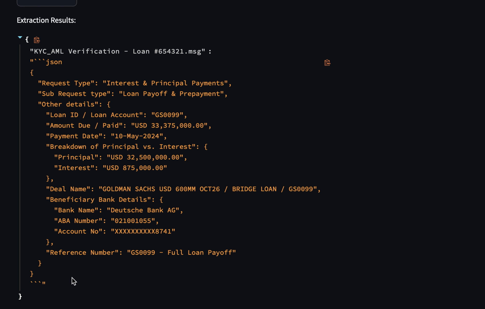

# 🚀 Project Name

## 📌 Table of Contents
- [Introduction](#introduction)
- [Demo](#demo)
- [Inspiration](#inspiration)
- [What It Does](#what-it-does)
- [How We Built It](#how-we-built-it)
- [Challenges We Faced](#challenges-we-faced)
- [How to Run](#how-to-run)
- [Tech Stack](#tech-stack)
- [Team](#team)

---

## 🎯 Introduction
This project is designed to extract structured information from email files. By mapping email content against predefined request types (stored in a CSV file) and leveraging Google Generative AI, it automatically converts email data into a well-organized JSON format. This helps streamline and automate the processing of email requests.

## 🎥 Demo
🔗 [Live Demo](#) (if applicable)  
📹 [Video Demo](https://youtu.be/tFfvct76KJM) (if applicable)  
🖼️ Screenshots:



## 💡 Inspiration
The project was inspired by the need to efficiently handle diverse email formats and extract actionable information without manual intervention. The goal is to reduce processing time and minimize errors by automating data extraction from emails.

## ⚙️ What It Does

1. Email Upload: Allows users to select and upload multiple email files directly from their system.
2. Content Extraction: Reads email content from various formats (e.g., .msg, .pdf, .docx) using specialized libraries.
3. Mapping Requests: Utilizes a CSV file to map and categorize email requests into main and sub-request types.
4. AI Integration: Leverages Google Generative AI to extract key details and output the information as a structured JSON object.
5. User-Friendly UI: Provides an interactive Streamlit interface to manage file uploads and display results.

## 🛠️ How We Built It
The project is built using Python and Streamlit, integrating multiple libraries and tools:

1. Streamlit: For creating an intuitive web-based UI.
2. Google Generative AI: For extracting structured data from the email content.
3. CSV Handling: To maintain and parse request type mappings.
4. File Processing Libraries:
   extract-msg for .msg files
   pypdf for PDF files
   python-docx for Word documents
5. Environment Management: Utilizes python-dotenv to manage API keys and configuration settings.

## 🚧 Challenges We Faced
1. Multi-format Support: Ensuring robust handling of different email and document formats.
2. Error Handling: Managing exceptions and errors during file processing and API calls.
3. Data Integration: Seamlessly combining data from CSV mappings and email content into a coherent JSON structure.
4. Performance Optimization: Balancing speed and accuracy when processing multiple large files.

## 🏃 How to Run
1. Clone the repository  
   ```sh
   git clone https://github.com/ewfx/gaied-inbox-invaders
   ```
2. Install dependencies  
   ```sh
   pip install -r requirements.txt
   ```
3. Run the project
   
   Go to code/src then
    
   ```sh
   python -m streamlit run app.py
   ```

## 🏗️ Tech Stack
- 🔹 Frontend: Streamlit (Python based)
- 🔹 Backend: Python, Google Generative AI
- 🔹 Data Processing: CSV, extract-msg, pypdf, python-docx
- 🔹 Environment: python-dotenv

## 👥 Team
- **Omkar Ghugarkar** - [GitHub](https://github.com/omkarghugarkar007) | [LinkedIn](https://www.linkedin.com/in/omkar-ghugarkar-94b897194/)
- **Sahil Kedare** - [GitHub](https://github.com/sahilkedare) | [LinkedIn](https://www.linkedin.com/in/sahil-kedare-4b89031aa/)
- **Vishal Dange** - [GitHub](https://github.com/vishalbdange) | [LinkedIn](https://www.linkedin.com/in/vishalbdange/)
- **Sushmey Nirmal** - [GitHub](#) | [LinkedIn](https://www.linkedin.com/in/sushmey/)
